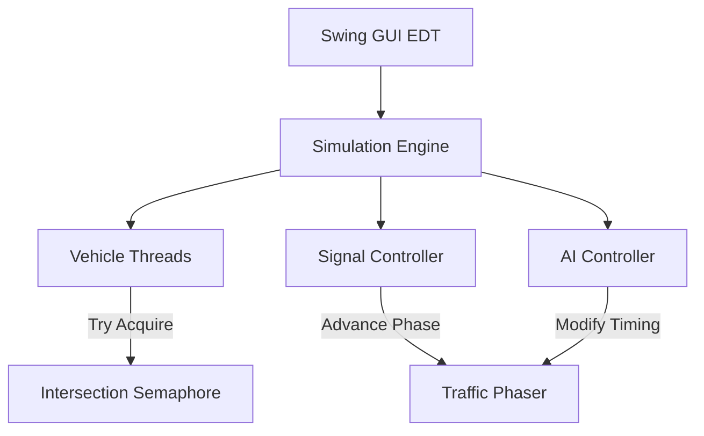

<div align="center">
  
# 🚦 AI-Based Smart Traffic Control System
### Using Operating System Synchronization Concepts

[](https://www.oracle.com/java/)
[]()
[]()
[]()

*A dynamic, multi-threaded traffic simulator built from scratch to demonstrate advanced Operating System concepts in real-time.*

[**Features**](#-features) • [**OS Concepts**](#-os-synchronization-concepts) • [**How It Works**](#-how-it-works) • [**Installation**](#-installation--running)

---


</div>

## 📖 Overview
This project is a 4th-semester University OS project that brings textbook Operating System synchronization problems to life. Instead of reading about threads in a terminal, this project visualizes them as **vehicles passing through an intersection**.

The intersection is a **critical section**, the traffic lights are **shared resources**, and the cars are **threads** competing for access without crashing.

## ✨ Features
- **🚗 Multi-threaded Engine:** Every single vehicle is an independent Java Thread running its own lifecycle.
- **🧠 AI Traffic Controller:** A smart background thread analyzes congestion every 3 seconds and dynamically adjusts traffic light phases (Proportional Timing, Emergency Override, Anti-Starvation).
- **🚨 Emergency Priority:** Spawning Police or Ambulances triggers the AI to flush the lane and grant maximum green time.
- **📊 Real-Time Dashboard:** Tracks max wait times, total vehicles passed, and active OS components.
- **🎨 Custom Java2D Rendering:** 30fps smooth rendering with glow effects, countdown timers, and visual indicators.

---

## ⚙️ OS Synchronization Concepts
This project implements `java.util.concurrent` primitives to safely manage thread execution.

| Concept | Implementation in Project | Purpose |
|---------|---------------------------|---------|
| **Semaphore** | `IntersectionSemaphore` | Limits the intersection to a maximum of 3 vehicles at once to prevent collisions. |
| **CountDownLatch** | `StartLatch` | Acts as a starting gun. Holds all generated vehicle threads until the user clicks "Start". |
| **CyclicBarrier** | `ConvoyBarrier` | Groups 3 vehicles together so they wait for each other and cross the intersection as a convoy. |
| **Phaser** | `TrafficPhaser` | Controls the 4-phase cyclic traffic light system (N-S Green ➔ Yellow ➔ E-W Green ➔ Yellow). |
| **Exchanger** | `VehicleExchanger` | Allows a North vehicle thread and an East vehicle thread to meet and swap congestion data. |
| **Deadlock** | `DeadlockManager` | Intentionally locks two resources in a circular wait to demonstrate a system freeze. |
| **Preemption** | `DeadlockManager` | Resolves the deadlock by interrupting one thread and forcing it to drop its lock. |

---

## 🚀 Installation & Running

No external dependencies or build tools (Maven/Gradle) are required. Just pure Java!

### Prerequisites
- JDK 11 or higher installed (`java` and `javac` in PATH).

### 1. Clone the repo
```bash
git clone https://github.com/yourusername/Smart-Traffic-OS-Simulator.git
cd Smart-Traffic-OS-Simulator
```

### 2. Compile the project
```bash
javac -encoding UTF-8 -d out src/Main.java src/model/*.java src/sync/*.java src/ai/*.java src/simulation/*.java src/gui/*.java src/utils/*.java
```

### 3. Run the simulator
```bash
java -cp out Main
```

---

## 🎮 How to Use the Simulator
Once the GUI opens:
1. Click **▶ Start** to fire the CountDownLatch and begin the simulation.
2. Click **Add Normal** to spawn blue cars, or **Add Emergency** to spawn red/orange flashing vehicles and watch the AI react.
3. Click **Trigger Deadlock** to intentionally freeze two threads in the intersection, then click **Resolve Deadlock** to apply preemption.
4. Watch the **Simulation Logs** panel when clicking the **Demo** buttons to see thread communication in real-time.

---

## 🏗️ Architecture



---

<div align="center">
<b>Built for demonstration of Operating System Principles.</b><br>
<i>No vehicles were harmed in the making of this simulation.</i>
</div>
